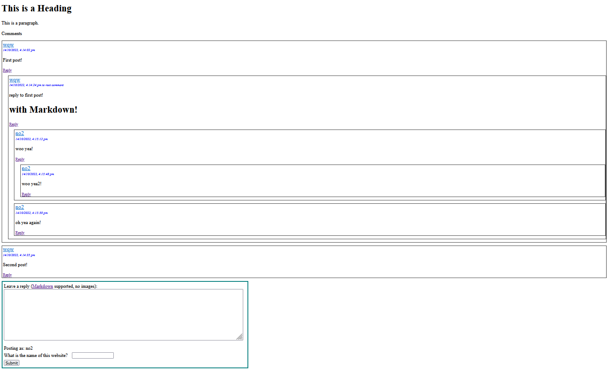

# Minimal commenting engine Showcase

Threaded commenting engine using golang for server backend and plain html/js/css frontend. Learning, straight to guts project, don't expect any standards and extensibility.

## Features

- Threaded comments, sanitization and supported by markdown (minus images)

- Authentication for anonymous users with jwt tokens, stored in cookies.

- Single Sign On (SSO) using Ouath2 and google as the identity provider

- Golang for backend server, using BoltDB for storage. CORS handling.

- Plain HTML/JS for frontend

- Email notifications via Sendgrid

- Posts are sorted by time/replies

## Installing and running

Requires go 1.18.

- Generate rsa keypairs via `openssl genrsa -out app.rsa 4096` and `openssl rsa -in app.rsa -pubout > app.rsa.pub` and place them in the same location as the executable generated.

- `go mod vendor` to vendor a local copy of dependencies.

- `go build` compiles all `go` files to `main.exe` 

- `./main.exe` to run the server, port 3000 by default.

- Host the frontend by running `cd frontend_sample` and `python -m http.server`, launch a browser and direct the url to `localhost:8000`

- Post as an anonymous guy

## Setting up SSO via google

- Go to https://console.cloud.google.com (using Chrome, firefox is bugged) and create a project. Create a ClientID and navigate to `Credentials`. Add to `Authorized redirect URIs` an entry that is the url of your server's auth callback, eg. `http://localhost:3000/auth/google/callback`

- Also, take note of the entries on the right, `Client ID` and `Client secret`. Replace all instances of `{GOOGLE_CLIENT_ID}` with the value in `Client ID` and `{GOOGLE_CLIENT_SECRET}` with the value in `Client Secret`

- To test, click on the Google Signin link in the reply box, it should take and redirect you to google's signin page.

## Setting up email notifications

- Sign up with Sendgrid

- Replace `{ADMIN_EMAIL}` with the admin's email

- Replace `{SENDGRID_KEY}` with the key provided by sendgrid, and `{SENDGRID_FROM}` with the sender's name  and `{SENDGRID_FROM_EMAIL}` with the sender's email (both of which you set in the sendgrid admin panel)

### References

- https://www.loginradius.com/blog/engineering/google-authentication-with-golang-and-goth/

### TODO (if ever)

- XSRF and CSRF protection: Need to setup a flow that requests for html of a reply box with a hidden unique id, and require the user to send that for posting the comment

- Signing out, proper refreshing